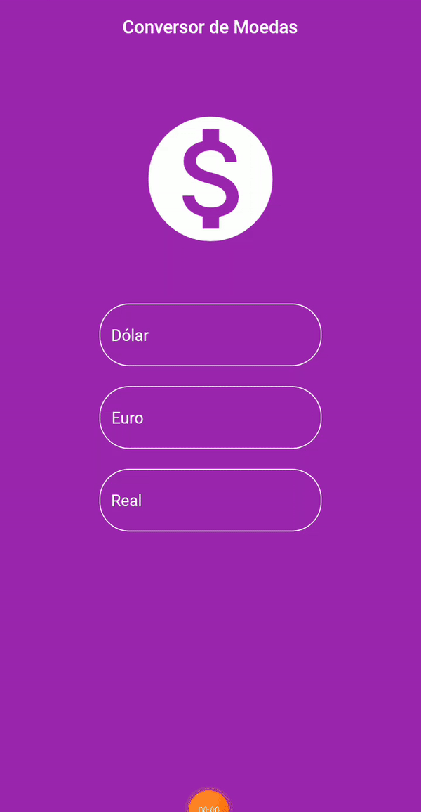

# Conversor de Moedas
 Um simples app para conversão de moedas utilizando API para obter os parâmetros de conversão em tempo real.

***
### Download do Aplicativo (APK)
Faça o download do arquivo APK do app e instale-o em seu smartphone.

  <a href="https://drive.google.com/u/0/uc?id=1v8d0P74Zbdj6RtQ7Jxzj_IX9f3Ey4ckj&export=download">Download App</a>

 

 
 

## Aprendizado
* Utilização de *Forms*.
* Utilização de `setState`.
* Consumo de API para conversão das moedas.
